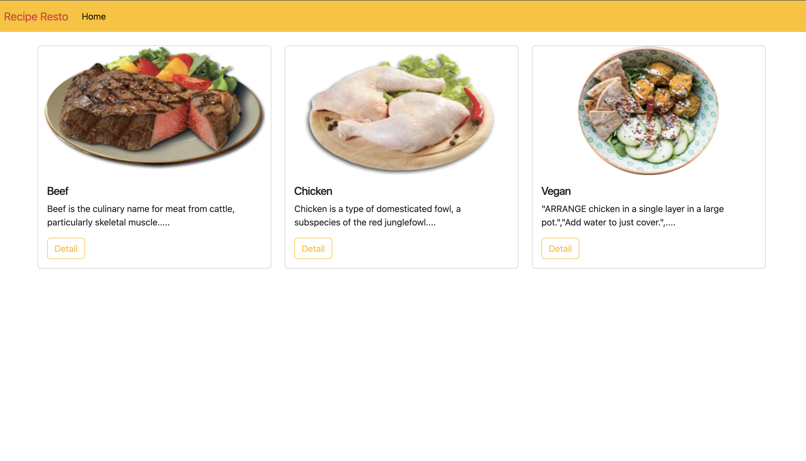
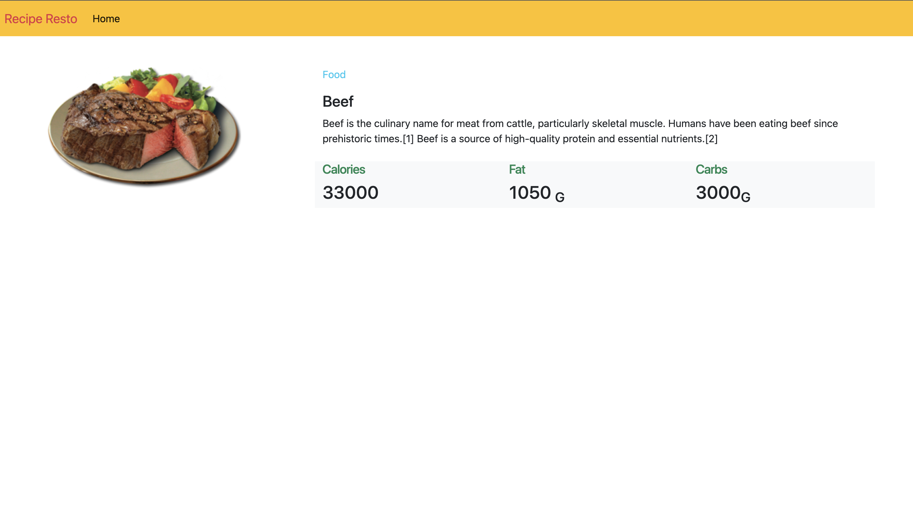

# Soal 
* 1 Buatlah file dengan nama soal1.php , lalu buatlah array string dengan data sebagai berikut:
    kalimat1 = "Latihan UTS"
    kalimat2 = "Tanggal : ".date('Y-m-d')
    kalimat3 = "belajar php menyenangkan"

    Lakukan perintah:
     - string UPPER CASE untuk latihan uts
     - string explode untuk tgl
     - substring untuk tahun
     - strrev untuk kalimat3
    Tampilkan menggunakan bootstrap

                    LATIHAN UTS
                                    tgl : 2023-03-08
             Tahun : 23
                    nakgnaneynem php rajaleb

2. Buatlah array 2 dimensi untuk menampilkan tabel seperti dibawah:
Gunakan fungsi  array sum dan array column
Hitung penjualan jika penjualan jaket pria : 800
                                jaket wanita : 200

  
<table class="table">
  <thead>
    <tr>
      <th scope="col">#</th>
      <th scope="col">Nama Produk</th>
      <th scope="col">Kategori Produk</th>
      <th scope="col">Image</th>
      <th scope="col">Stok</th>
      <th scope="col">Harga</th>
      <th scope="col">Penjualan</th>
    </tr>
  </thead>
  <tbody>
    <tr>
      <th scope="row">1</th>
      <td>Jaket Pria</td>
      <td>Fashion</td>
      <td></td>
      <td>300</td>
      <td>170.000</td>
      <td>200</td>
      </tr>
    <tr>
      <th scope="row">2</th>
      <td>Jaket Wanita</td>
      <td>Fashion</td>
      <td></td>
      <td>300</td>
      <td>250.000</td>
      <td>100</td>
    </tr>
   <tr>
    <td colspan="6">Sum</td>
    <td>Otomatis Bertambah</td>
   </tr>
  </tbody>
</table>

3. Buat database dan koneksi database sesuai permintaan berikut:
  database : recipe_db
  table food
  * id int(11) AUTO INCREAMENT
  * menu varchar(255)
  * kategori varchar(255)
  * calory int(11)
  * fat int(11)
  * carbs int(11)
  * image varchar(255)

  
  
  